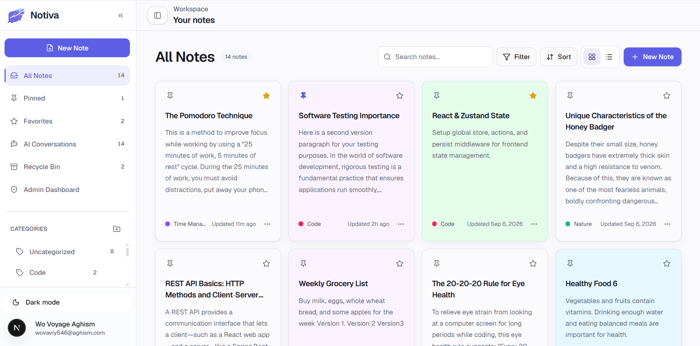

# Notiva Frontend

Notiva is a responsive note-taking and AI-assisted productivity workspace built with Next.js. It provides a focused place to write rich-text notes, organize knowledge, recover earlier versions, and use AI without automatically overwriting user content.

This repository contains the frontend only. Authentication, persistence, email, image storage, authorization, and AI-provider access are handled by the separate Notiva Spring Boot API.



## Main features

- Public product landing page
- Email/password registration and login
- Google OAuth login
- Rotating refresh-token session handling
- Password recovery and email verification
- Responsive desktop, tablet, and mobile navigation
- Notes dashboard with server-side search, filters, sorting, and pagination
- Categories, pinning, favorites, and note background colors
- Tiptap rich-text editor with autosave
- Headings, lists, checklists, links, tables, code blocks, quotes, and dividers
- Note image upload, paste, and drag-and-drop support
- Recycle bin, permanent deletion, and version restoration
- AI writing tools with preview and explicit user acceptance
- Note-specific and all-notes conversations
- Semantic note search with source references
- Profile, appearance, editor, notes-view, security, and AI usage settings
- Privacy-conscious admin dashboard and user metadata

## Technology stack

- Next.js 16 App Router
- React 19
- Strict TypeScript
- Tailwind CSS
- shadcn/Radix UI primitives
- TanStack Query
- React Hook Form and Zod
- Axios
- Tiptap
- Lucide React
- `next-themes`

## Application architecture

```text
Browser
  -> Notiva Next.js frontend
  -> Notiva Spring Boot REST API
  -> PostgreSQL / email / image storage / AI provider
```

The frontend communicates only with the Spring Boot API. It never calls Groq or another AI provider directly and must not contain database credentials, OAuth client secrets, JWT secrets, or AI API keys.

## Requirements

Before starting, install:

- [Node.js](https://nodejs.org/) 20.9 or later
- npm
- Git
- The Notiva Spring Boot backend, running locally on port `8080`

## Clone and run locally

### 1. Clone the repository

```bash
git clone https://github.com/Kyaw-Kyaw-Sann/notiva-web.git
cd notiva-web
```

### 2. Install dependencies

```bash
npm install
```

### 3. Create the local environment file

Copy `.env.example` to `.env.local`.

macOS/Linux:

```bash
cp .env.example .env.local
```

Windows PowerShell:

```powershell
Copy-Item .env.example .env.local
```

The local values should be:

```env
NEXT_PUBLIC_API_BASE_URL=http://localhost:8080
NEXT_PUBLIC_SITE_URL=http://localhost:3000
```

Both values must be absolute `http://` or `https://` URLs. The application reports a clear startup/build error when either value is missing or invalid.

### 4. Start the backend

Run the Notiva Spring Boot API at:

```text
http://localhost:8080
```

The backend should allow this frontend origin through CORS:

```text
http://localhost:3000
```

The public landing page can render without the backend, but authentication, notes, images, AI, profile, and admin features require it.

### 5. Start the frontend

```bash
npm run dev
```

Open [http://localhost:3000](http://localhost:3000).

## Google OAuth for local development

Google sign-in begins through the backend:

```text
http://localhost:8080/oauth2/authorization/google
```

After successful authentication, the backend redirects to:

```text
http://localhost:3000/oauth2/callback#access_token=...
```

The backend and Google OAuth configuration must both use the correct local callback/origin values. The frontend removes the token fragment from browser history before loading the authenticated user.

## Environment variables

| Variable | Required | Local value | Purpose |
| --- | --- | --- | --- |
| `NEXT_PUBLIC_API_BASE_URL` | Yes | `http://localhost:8080` | Base URL of the Notiva Spring Boot API. |
| `NEXT_PUBLIC_SITE_URL` | Yes | `http://localhost:3000` | Canonical frontend URL used by metadata, sitemap, and robots output. |

These variables are intentionally browser-visible configuration. Never add secrets to `NEXT_PUBLIC_*` variables or commit secrets in any environment file.

## Available npm scripts

| Command | Description |
| --- | --- |
| `npm run dev` | Start the local development server. |
| `npm run lint` | Run ESLint. |
| `npm run typecheck` | Generate Next.js route types and run TypeScript checks. |
| `npm run build` | Create an optimized application build. |
| `npm run start` | Run the optimized build locally after `npm run build`. |
| `npm run check` | Run lint, type-check, and build checks together. |

## Verify the project

Before opening a pull request or sharing changes, run:

```bash
npm run check
```

To test the optimized application locally:

```bash
npm run build
npm run start
```

Then open [http://localhost:3000](http://localhost:3000).

## Project structure

```text
src/
├── app/                 # App Router pages, layouts, metadata, and route groups
├── components/          # Shared UI, landing, and application layout components
├── features/            # Auth, notes, categories, AI, profile, settings, and admin
├── hooks/               # Shared React hooks
├── lib/                 # API client, auth utilities, environment, and helpers
├── providers/           # Query, theme, and root providers
└── types/               # Shared application types
```

Feature folders keep their own API functions, components, hooks, schemas, types, and utilities when those files are needed.

## Important behavior

- TanStack Query manages server state and cache invalidation.
- URL parameters preserve note search, filter, sort, and pagination state.
- Access tokens are attached only to authenticated API requests.
- Refresh tokens are used only for refresh and logout operations.
- Google OAuth sessions currently receive no refresh token from the backend.
- Tiptap JSON is stored as `contentJson`; searchable text is derived as `plainText`.
- Autosave is debounced and protects newer edits from stale responses.
- AI output is previewed before the user chooses to replace or insert content.
- Saved note images are not remotely deleted when removed from the current editor because older note versions may still reference them.
- Client-side admin checks improve UX; the backend remains the authorization boundary.

## Troubleshooting

### The application reports a missing environment variable

Confirm that `.env.local` exists in the project root and contains both required variables. Restart the development server after changing the file.

### API requests fail or show a network error

Confirm that the backend is running at `http://localhost:8080` and allows `http://localhost:3000` through CORS.

### Google sign-in returns to the login page

Check the backend OAuth redirect configuration, the Google authorized origins/redirect URIs, and the frontend callback URL. Also confirm that `GET /api/auth/me` accepts the returned access token.

### A replaced landing-page screenshot still looks old

Perform a hard refresh. The frequently updated `DS2.png` preview intentionally bypasses Next Image optimization so the browser can revalidate the public file.

## Screenshots

The landing page uses real application screenshots stored as `public/DS1.png` through `public/DS5.png`. Only demo names, email addresses, and note content should be committed to a public repository.
